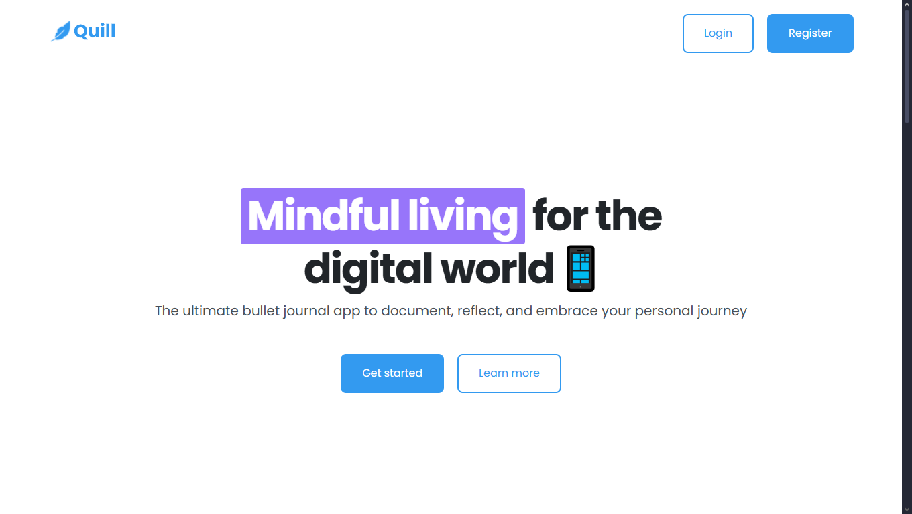

# Quill Project

Quill is a simple journaling web application that allows users to
register, log in, and create personal journal entries. It's built using
**HTML, CSS, and static assets** with a focus on clean design and
usability.

---

## 📂 Project Structure

    quill-project/
    ├── index.html            # Landing page
    ├── login.html            # Login page
    ├── register.html         # Registration page
    ├── create-journal.html   # Journal creation page
    ├── app.css               # Main stylesheet
    ├── queries.css           # Responsive design styles
    ├── images/               # Icons and illustrations
    └── .vscode/              # Editor settings (optional)

---

## 🚀 Getting Started

1.  **Clone or download this repository**

    ```bash
    git clone https://github.com/rimarayya/quill-project
    ```

2.  **Move to the project file**

    ```bash
    cd quill-project
    ```

3.  **Open `index.html` in your preferred web browser**

That's it --- no server setup required since this is a static front-end
project.

---

## ✨ Features

- User registration and login pages\
- Journal creation page\
- Responsive styling with `queries.css`\
- Custom icons and illustrations

---

## 🛠️ Technologies Used

- **HTML5** -- page structure\
- **CSS3** -- styling and responsive layout\
- **SVG/PNG assets** -- icons and images

---

## 📸 Preview



---

## 📌 Future Improvements

- Connect to a backend for persistent journal entries\
- Add authentication and session handling\
- Enable editing/deleting journal entries

---
